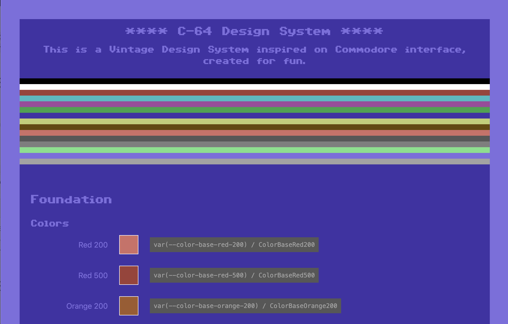

# C64 Design System
This is a Vintage Design System inspired on Commodore interface, created for fun.



## Installation

```
npm install @dariobrozzi/c64-design-system
```

## Documentation App

```
npm run doc
```

## File structure

```
/doc                # documentation app
/src                # design system source code
/style-dictionary   # token definitions
/package.json
/README.md
```

## What's Next
- Extending tokens
- Components
- Complete documentation

## Resources
- [Style Dictionary](https://styledictionary.com/)
- [Color palette](https://en.wikipedia.org/wiki/Commodore_64#Graphics)
- [Font](https://style64.org/c64-truetype)